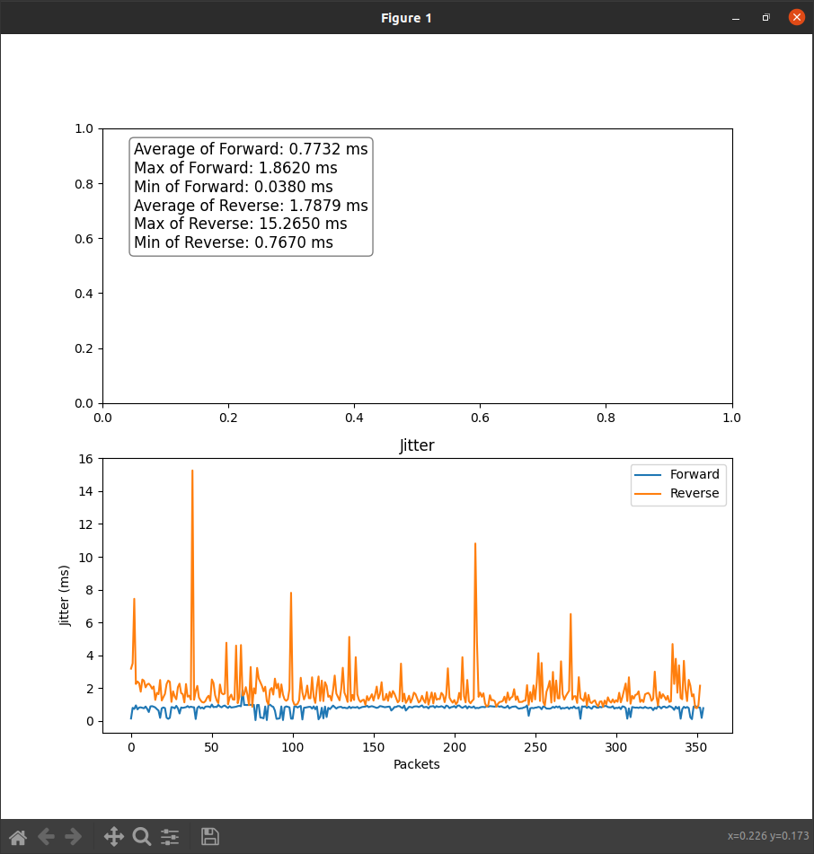

# Calculate jitter (delay) between in and out traffic

Currently it's only works if the file has two stream and no more or less.

### Before you run it

You have to install these `pip` packages: 

```
python -m pip install -U pip
python -m pip install -U matplotlib
```

### How to start the program 

```
python3 parse.py <file.csv> <src_ip> <dst_ip>
```

For example: 
```
python3 parse.py tg2-no-1h.csv 10.2.0.17 10.2.0.11
```

### How it works

1. Read the `csv` file and parse it into a big 2d list
  - sublist elements: 
    0. Packet arrival time 
    1. Source IP
    2. Destination IP
    3. Timestamp
    4. Sequence number
2. Sort and make math on forward and reverse traffic 
  - math:
    ``` 
    Tick = 1 / 8000
    Expected_Arrival_Time = (N_Timestamp - First_Timestamp) * Tick
    Jitter = abs(Expected_Arrival_Time - Real_Arrival_Time) * 1000
    ```
3. Make the plot

### Example plot



